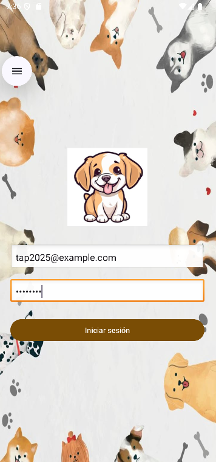
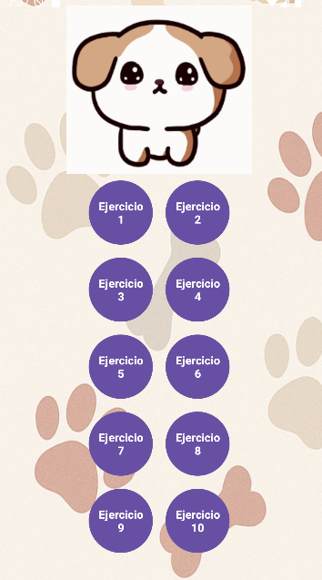
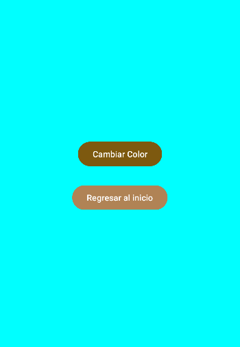
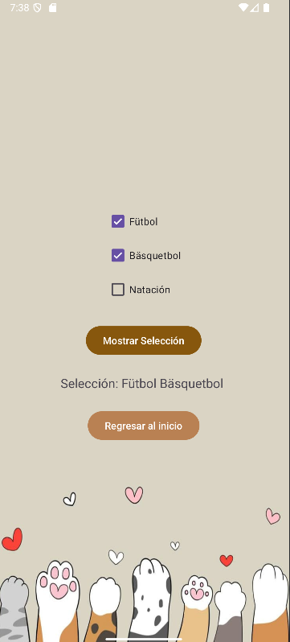
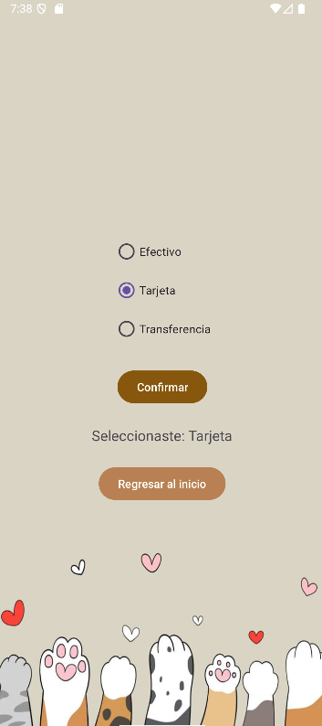
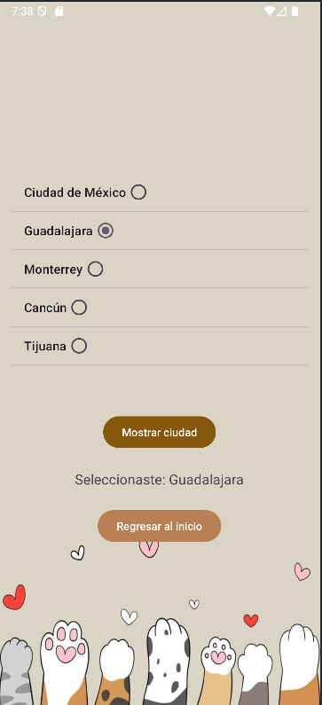
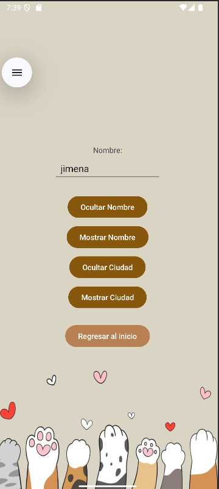
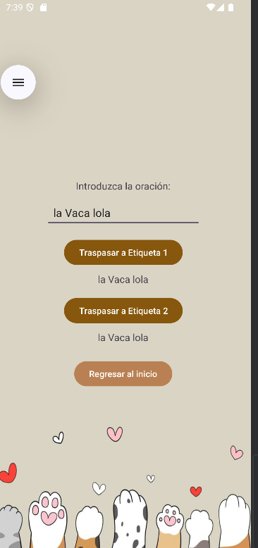
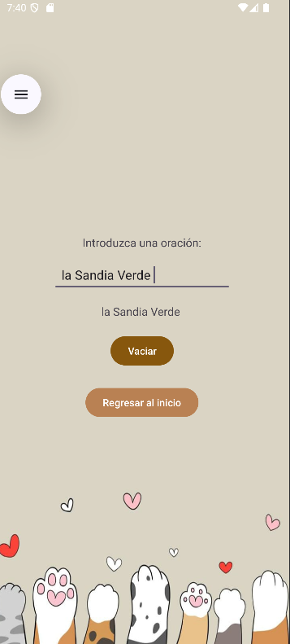
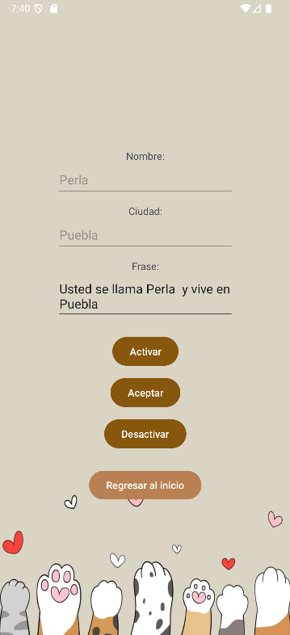

# AndroidStudio
# Android Skills Portfolio

**Equipo 1**  
Pérez Jiménez Xana Amalinalli– Desarrollador y diseñador

---

##  ¿Qué hace la aplicación?

Esta aplicación móvil contiene una colección de ejercicios prácticos en Android Studio, diseñados para practicar habilidades esenciales en el desarrollo móvil usando Java. Incluye funcionalidades como botones, entradas de texto, cálculos, visibilidad de elementos y navegación entre actividades.

---

##  Tipo de sistema

- Proyecto Móvil en **Java (Android Studio)**
- SDK mínimo: **API 24 (Android 7.0)**
- Librerías externas: **Ninguna**

---

##  Ejercicios incluidos

**LoginActivity**  
**Qué hace:**  
Esta es la primera pantalla que se muestra al iniciar la aplicación. Su función es simular un sistema de acceso con campos para ingresar nombre de usuario y contraseña. Aunque no hay una validación compleja, se puede configurar para verificar datos simples o avanzar sin validación. Al presionar el botón de iniciar sesión, si los campos están correctos o llenos, se redirige al usuario al menú principal de la aplicación. Esta pantalla representa la entrada básica a una app con autenticación.

**Funcionalidad:**  
Si los datos son correctos, permite pasar al menú principal (MainActivity).  


---

**MainActivity (Menú de botones)**  
**Qué hace:**  
Una vez que el usuario accede, se muestra el menú principal. Aquí aparecen 10 botones numerados, cada uno representando un ejercicio distinto. Cada botón abre una actividad diferente que demuestra un concepto básico de programación en Android, como uso de botones, checkboxes, listas, entrada de datos, entre otros. Esta pantalla es como un hub de navegación que permite acceder de forma rápida y directa a todos los ejercicios.

**Funcionalidad:**  
Navegación sencilla a todas las actividades del portafolio.  


---

1️⃣ **Ejercicio 1**  
**Qué hace:**  
Esta actividad incluye un botón y un TextView (etiqueta de texto). La idea es simple: cuando el usuario presiona el botón, el texto de la etiqueta cambia a otro mensaje. Es un ejemplo básico pero muy importante para entender cómo funciona la interacción entre componentes: el usuario hace una acción (clic), y la interfaz reacciona (cambia el texto).  
 


---

2️⃣ **Ejercicio 2**  
**Qué hace:**  
En esta pantalla se muestra cómo cambiar dinámicamente el color de fondo de la actividad al presionar un botón. Al hacer clic, todo el fondo de la pantalla cambia a otro color, como azul, rojo, o el que se haya definido. Este ejercicio es útil para practicar cómo modificar propiedades visuales de la interfaz desde el código.  

  


---

3️⃣ **Ejercicio 3**  
**Qué hace:**  
Esta actividad presenta varias opciones de deportes como fútbol, básquetbol, y natación, cada una acompañada de un CheckBox. El usuario puede seleccionar todas las que quiera. Al presionar un botón, se muestra un mensaje con los deportes elegidos. Aquí se aprende a trabajar con selección múltiple, obtener los elementos marcados y mostrarlos de forma clara en pantalla.  




---

4️⃣ **Ejercicio 4**  
**Qué hace:**  
En esta actividad se presentan distintas formas de pago, pero solo se puede elegir una gracias a los RadioButton. Al seleccionar y confirmar, se muestra la opción elegida. Aquí se practica cómo trabajar con selección única.  




---

5️⃣ **Ejercicio 5**  
**Qué hace:**  
En esta actividad se muestra una lista de ciudades usando un ListView. El usuario puede tocar una ciudad para seleccionarla. Una vez que lo hace, el nombre de esa ciudad se guarda y se puede mostrar en una etiqueta al presionar un botón. Este ejercicio es útil para entender cómo funcionan las listas en Android y cómo capturar lo que el usuario elige.  



---

6️⃣ **Ejercicio 6**  
**Qué hace:**  
Aquí se trabaja con la visibilidad de los elementos. Hay una entrada de texto que puede mostrarse u ocultarse al presionar un botón. Esto permite entender cómo cambiar el estado visible de un componente en pantalla, algo muy común cuando queremos esconder o mostrar cosas dependiendo de lo que haga el usuario.  




---

7️⃣ **Ejercicio 7**  
En esta actividad hay una entrada de texto donde el usuario puede escribir algo. Al presionar un botón, ese texto se copia a una etiqueta (TextView). Luego, con otro botón, ese mismo texto pasa a una segunda etiqueta. Este ejercicio ayuda a comprender cómo mover datos entre diferentes elementos de la interfaz.  


---

8️⃣ **Ejercicio 8**  
En esta pantalla el usuario puede escribir lo que quiera en un campo de texto, pero al presionar un botón, el contenido se borra completamente. Es útil para practicar cómo manipular el contenido de los EditText y cómo responder a eventos con acciones específicas como limpiar formularios.  


---

9️⃣ **Ejercicio 9**  
**Qué hace:**  
En esta actividad se puede activar o desactivar una entrada de texto presionando botones. Además, se muestra un mensaje dependiendo de si el campo está activo o no. Esto sirve para practicar el uso del método .setEnabled() y entender cómo cambiar el comportamiento de los elementos según el estado en el que se encuentren.  



---

🔟 **Ejercicio 10**  
**Qué hace:**  
Esta actividad combina entrada de texto con matemática. El usuario escribe el radio de un círculo en un campo, y al presionar enter, se calculan automáticamente el área y el perímetro. Los resultados se muestran en etiquetas.  


> Todos los ejercicios tienen un botón para regresar al menú principal (`MainActivitybotones`).

---

## 🛠️ Requisitos Técnicos

- **SDK mínimo:** API 24 (Android 7.0) o superior  
- **Gradle:** Compatible con versiones recientes de Android Studio (Hedgehog o posterior)
- **Librerías externas:** No se usaron librerías externas como Retrofit, Glide, etc.
- **Buenas prácticas:**  
  - Variables descriptivas  
  - Organización por actividad  
  - Botón de navegación de regreso incluido en todos

---

## Pasos para instalar y ejecutar

1. **Descarga el proyecto**:
   - Opción 1: Clonar con Git  
     ```bash
     git clone https://github.com/tu-usuario/android-skills-portfolio.git
     ```

2. **Abrir el proyecto en Android Studio**:
   - Selecciona **"Open an existing project"** y elige la carpeta del proyecto.

3. **Sincronizar el proyecto**:
   - Android Studio descargará las dependencias automáticamente.
   - Si no, haz clic en **"Sync Now"** cuando aparezca el aviso.

4. **Configurar un emulador o conecta tu celular**:
   - Usa Android 7.0 (API 24) o superior.
   - Si es un celular físico, activa **Depuración por USB**.

5. **Ejecutar la app**:
   - Haz clic en el botón **Run ▶️** y selecciona el dispositivo.
